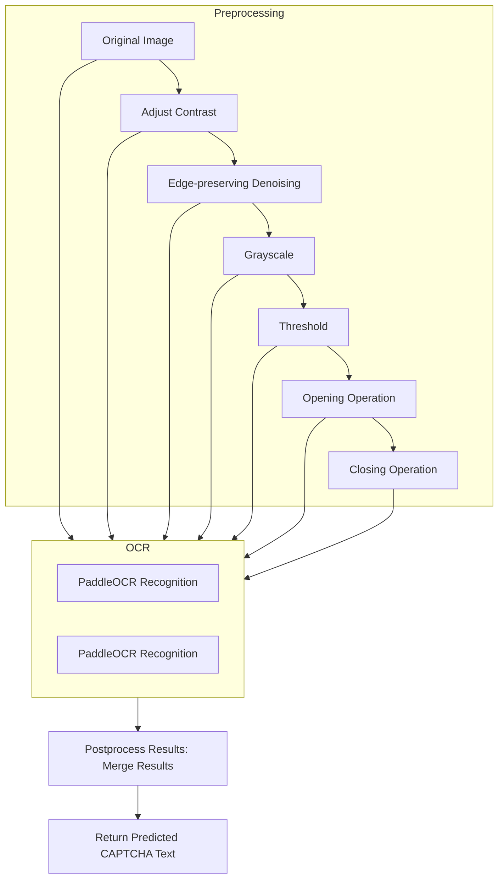

## captcha-recognition

### 使用語言及技術
Python、OpenCV、paddleOCR、easyOCR、電腦視覺

### 流程

```mermaid
graph TD
    subgraph Preprocessing
        direction LR
        C1[Original Image]
        C2[Adjust Contrast]
        C3[Edge-preserving Denoising]
        C4[Grayscale]
        C5[Threshold]
        C6[Opening Operation]
        C7[Closing Operation]
    end

    subgraph OCR
        D1[PaddleOCR Recognition]
        D2[PaddleOCR Recognition]
    end

    C1 --> OCR
    C2 --> OCR
    C3 --> OCR
    C4 --> OCR
    C5 --> OCR
    C6 --> OCR
    C7 --> OCR

    C1 --> C2
    C2 --> C3
    C3 --> C4
    C4 --> C5
    C5 --> C6
    C6 --> C7

    OCR --> F[Postprocess Results: Merge Results]
    F --> G[Return Predicted CAPTCHA Text]


```
